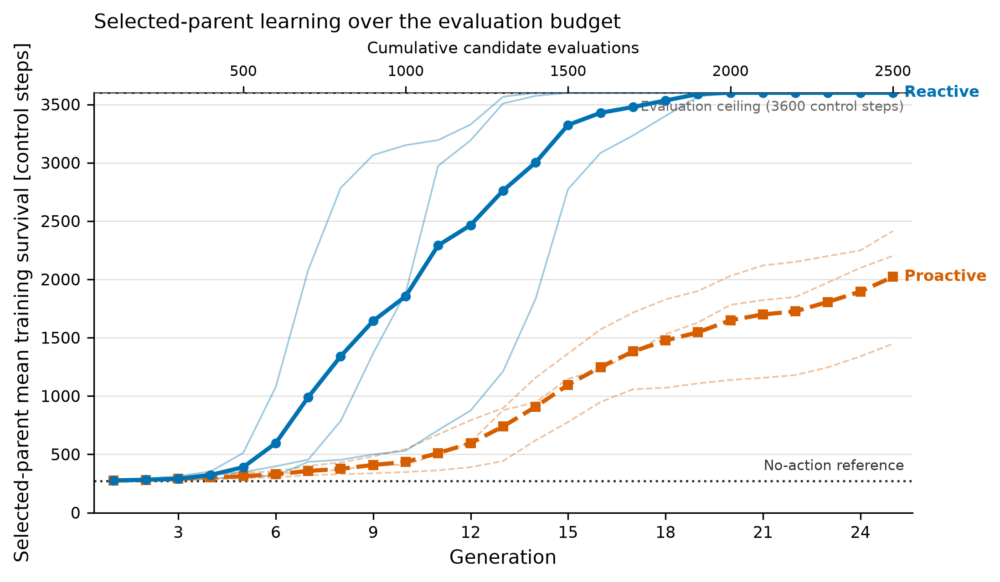

# Internal state in evolved visual control

This repository accompanies the AE4350 report *Internal state in evolved visual
control: Reactive and proactive controllers for Chromium Dino*. The study
compares a reactive feed-forward neural network (FFNN) with a continuous-time
recurrent neural network (CTRNN). Both controllers have 93 evolved parameters,
receive the same five measurements extracted from the current rendered frame,
and are evaluated on the same seeded worlds and candidate budget.

The main result is deliberately narrower than "recurrence is better". The
reactive controller learned faster within the fixed budget. The selected CTRNN
did use its recurrent state, but that mechanism did not produce a consistent
validation advantage and the selected reactive policy performed better on the
locked test worlds.

The complete ten-page report is available at
[paper/JH_de_Vries_AE4350_report.pdf](paper/JH_de_Vries_AE4350_report.pdf).

## Results



The figure shows selected-parent training survival over 2,500 candidate
evaluations. Thin lines are independent optimiser runs and thick lines are
architecture means. Survival is capped at 3,600 control steps.

The reported results are:

- All three reactive runs reached the 3,600-step training ceiling; none of the
  three proactive runs did so within the available budget.
- Mean validation survival was 2,873 steps for the reactive architecture and
  2,616 for the proactive architecture. The matched proactive-minus-reactive
  effect was -257 ± 1,094 steps (two-sided 95% Student-t interval, three
  optimiser runs), so validation did not establish a consistent
  architecture-level advantage.
- The mean architecture ordering changed across the tested
  initialization-and-mutation scales and parent-offspring configurations. All
  paired RQ2 intervals included zero.
- Holding the first five-feature observation constant reduced both frozen
  policies to about 271 steps, showing that both depended on updated visual
  input.
- Resetting the selected CTRNN's state before every control step reduced its
  mean survival from 2,683 to 271 steps over the same five validation worlds.
  This demonstrates functional state use by that policy.
- On 20 locked test worlds, the selected reactive policy averaged 3,379 steps
  and the selected proactive policy 1,625 steps. Reactive survival was higher
  on 19 worlds; ceiling counts were 17/20 and 0/20 respectively.

These conclusions concern finite-budget learning and the two frozen
representatives in this task. Three optimiser runs per RQ1/RQ2 condition give
descriptive uncertainty, not strong significance evidence. The locked-test and
intervention intervals describe variation across worlds for fixed policies,
not variation across independently evolved controllers.

## Experiment

The research question is:

> How do reactive and proactive evolved controllers differ in learning,
> generalisation, and sensorimotor behaviour in the Chromium Dino task?

The controller never reads game-engine state. A fixed perception front-end
extracts five normalized quantities from each clean 600 × 150 rendered frame:
obstacle-relative x and y, obstacle width and height, and the Dino's vertical
position. The available actions are no key, jump held, and duck/fast-drop held.
One controller decision advances one fixed 60 Hz game step.

| | Reactive | Proactive |
| --- | --- | --- |
| Controller | FFNN, `5 → 10 → 3` | CTRNN, `5 → 6 recurrent → 3` |
| Persistent controller state | None | Six recurrent states |
| Evolved parameters | 93 | 93 |
| Action selection | Raw-score `argmax` | Raw-score `argmax` |

Fitness is mean survival over ten training worlds, with a 3,600-step ceiling
and no reward shaping. The project uses an elitist `(μ + λ)` Evolution Strategy.
The experiments are separated as follows:

- **RQ1:** adaptive `(20 + 80)` evolution for 25 generations with optimiser
  seeds 7, 17 and 27.
- **RQ2:** five one-factor-at-a-time conditions. The configured scales are
  `σ = 0.1, 0.3, 0.6` at `20 + 80`; the population configurations are
  `10 + 90`, `20 + 80`, and `40 + 60` at fixed `σ = 0.3`. Every condition uses
  three optimiser seeds per architecture.
- **RQ3:** paired normal, constant-input, five single-channel ablation, and
  recurrent-state-reset replays on five validation worlds.
- **Locked test:** one validation-frozen representative per architecture on 20
  previously unused worlds.

In RQ2, the configured `σ` sets both the initial population spread and the
offspring mutation magnitude. It should therefore be interpreted as an
initialization-and-mutation scale, not as an isolated mutation-only effect.
The exact condition matrix and disjoint seed partitions are in
[configs/experiment-plan.json](configs/experiment-plan.json).

## Installation

The project requires Python 3.11, [uv](https://docs.astral.sh/uv/), Node.js/npm,
and the Chromium build installed by Playwright.

Install the Python environment and browser:

```console
uv sync --extra dev
uv run --no-sync playwright install chromium
uv run --no-sync python scripts/check_system.py --json
```

The final command reports the Python, NumPy, CPU and optional controller
accelerator configuration.

On Windows, install the game dependencies and build the TypeScript application
with:

```console
npm.cmd --prefix game ci
npm.cmd --prefix game run build
```

On macOS or Linux, use `npm` instead of `npm.cmd`.

This finite run exercises the browser-perception-controller loop without
starting a scientific campaign:

<!-- markdownlint-disable MD013 -->

```console
uv run --no-sync python scripts/evolve.py --controller proactive --parents 2 --offspring 8 --training-seeds 101 --generations 1 --max-steps 600 --render human --simulation-speed 5 --exit-after-run
```

<!-- markdownlint-enable MD013 -->

It is an engineering smoke test only. The reduced population, single seed and
short horizon are not part of the reported evidence.

Optional CUDA controller inference can be installed with
`uv sync --extra dev --extra cuda`. Browser simulation and pixel perception
remain unchanged, and CPU is the portable default.

## Reproducing the study

Inspect all planned runs without launching browser workers:

```console
uv run --no-sync python scripts/run_experiments.py --dry-run
```

Run the dependency-ordered RQ1, RQ2, model-selection, RQ3 and locked-test
pipeline:

<!-- markdownlint-disable MD013 -->

```console
uv run --no-sync python scripts/run_experiments.py --accelerator auto --workers auto
```

<!-- markdownlint-enable MD013 -->

The full campaign consists of six RQ1 and 30 RQ2 optimisation runs. Each
standard run evaluates 2,500 candidates over ten training worlds, so this is a
substantial computation. Completed runs are skipped and compatible partial
runs resume from their checkpoints.

The report's saved model-v2 evidence is stored under
`results/model_v002_46ccc63ff585/`. To rebuild the self-contained results page
from those Parquet files:

<!-- markdownlint-disable MD013 -->

```console
uv run --no-sync python scripts/view_results.py --model-version 2 --model-hash 46ccc63ff585 --no-open
```

<!-- markdownlint-enable MD013 -->

This writes `scientific-results.html` in the repository root. The HTML contains
the figures and CSV exports and does not require a local server. New campaigns
receive their own model and experiment hashes and must not be pooled with the
reported campaign.

`scripts/replay.py` can replay a local checkpoint or model and apply the RQ3
interventions. Run `uv run --no-sync python scripts/replay.py --help` for the
required archive paths and options. Replay is diagnostic and is not an
independent statistical replicate.

## Verification

Run the Python checks with:

```console
uv run --no-sync python -m pytest -q
uv run --no-sync python -m ruff check .
uv run --no-sync python -m mypy src scripts tests
```

On Windows, run the TypeScript and visual-regression tests with:

```console
npm.cmd --prefix game run test:ts
npm.cmd --prefix game run test:visual
```

Use `npm` instead of `npm.cmd` on macOS or Linux.

## Repository layout

- `game/` contains the Chromium-derived TypeScript game, renderer and browser
  bridge.
- `src/dino_er/` contains perception, controllers, evaluation, evolution and
  scientific analysis.
- `scripts/` contains the experiment, replay, system-check and results-viewer
  command-line interfaces.
- `configs/experiment-plan.json` fixes the study conditions and seed
  partitions.
- `results/` contains the immutable Parquet evidence and generated scientific
  summaries for the reported campaign.
- `paper/` contains the submitted report; `media/` contains its selected README
  figure.
- `tests/` and `game/tests/` cover the Python and TypeScript implementations.
- `third_party/` records the pinned Chromium sources and licence information.

Checkpoints and saved controller archives under `artifacts/`, together with the
generated `scientific-results.html`, remain local runtime outputs.

## Scope and provenance

The result applies to the pinned Chromium-derived normal-mode task, the chosen
five-feature visual abstraction, the two 93-parameter architectures and the
tested evolutionary settings. The 3,600-step horizon right-censors strong
episodes; RQ2 does not estimate interactions; and a zeroed sensor is a strong
counterfactual rather than an independent feature-importance estimate. See the
paper for the full validity discussion.

The game is derived from Chromium's
`components/neterror/resources/dino_game` at revision
`1ccb91e11f09fbbdec4f8f754d0e2f7d28246660`. Attribution, source hashes,
local adaptations and the Chromium licence are recorded in
[THIRD_PARTY_NOTICES.txt](THIRD_PARTY_NOTICES.txt) and
[third_party/](third_party/).

Original project code is released under the [MIT License](LICENSE).

## Citation

```bibtex
@misc{de_vries_internal_state_2026,
  author = {de Vries, Jop},
  title  = {Internal State in Evolved Visual Control: Reactive and Proactive
            Controllers for Chromium Dino},
  year   = {2026},
  note   = {AE4350 Bio-inspired Intelligence and Learning for Aerospace
            Applications, Delft University of Technology},
  url    = {https://github.com/Jopdevries/dino-er}
}
```
